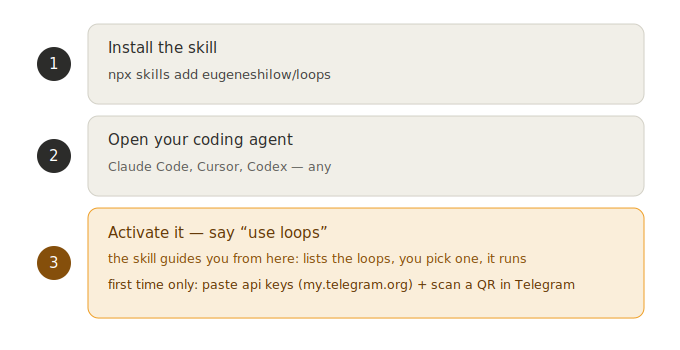

# loops

**Loop engineering, with hands.** Most agent loops run *inward* — edit a file, run it, keep the change. These run *outward*: your coding agent DMs your beta testers on Telegram, hears their voice notes, ships the fix, and replies — looping until the feedback dries up. In your own agent, on your own machine.

> You hand your agent a GitHub link. It logs into *your* Telegram, listens for testers' `@claude` voice notes, transcribes them locally, ships a small fix, and DMs back the new version. You watch.

Every loop is an open prompt (`SKILL.md`) plus a few small open scripts it calls. Nothing runs on a server, nothing phones home. Read the prompts before you run them — that's the whole security model.



## The loops

- **`tg-contacts-feedback`** — a closed loop with a known list of testers. It DMs them, waits for a reply that starts with `@claude` (text or a voice note), transcribes voice locally, polishes it into `{source, insight, action, return-question}`, ships a small git fix, and replies with the new version.
- **`tg-comments-feedback`** — an open loop over `@claude` mentions across your chats / a launch thread, grouped by theme. (Newer — less battle-tested than contacts.)
- **`setup`** — the installer prompt. Hand it to your agent and it wires everything up: api keys, Telegram QR-login, the transcription backend, and a smoke test.

The shared machinery — Telegram client, transcription, the durable inbox — lives once in [`spine/`](spine/README.md).

## Watch it connect

A fresh clone, your own Telegram, one QR scan — and it's live (real output, handle redacted):

```text
$ npm run login
Scan in Telegram -> Settings -> Devices -> Link Desktop Device
  [ a QR opens on your screen — scan it ]
Signed in successfully as You
Logged in as @you. Session saved to .loops/personal.session

$ node spine/poll.mjs --mode mentions
[connected as @you] mode=mentions
{ "mode": "mentions", "found": [], "count": 0 }
```

From here, a tagged voice note from a tester comes back as `{ feedback: "[voice->text]: ..." }`, the loop ships a fix, and replies in-thread.

## How it actually works

It logs into *your own* Telegram as a userbot (GramJS / MTProto), so it reads the DMs and chats you already have — no separate bot, your testers just reply to you. When a message starts with `@claude`, the loop treats it as feedback-for-the-agent: it takes the text or the voice note, transcribes voice locally with whisper, and an always-on poller drops the hit into a durable inbox so nothing is lost even when no agent session is up. A live session drains the inbox, acts, and replies in-thread to close the loop. It reacts 👀 so you can see it caught your ping, and it never puts `@claude` in its own messages — otherwise it would catch itself and spin forever.

## Install (it's a skill)

1. **Install the skill** — your agent learns the loop commands:
   ```
   npx skills add eugeneshilow/loops
   ```
2. **Open your coding agent** (Claude Code, Cursor, Codex — any) and say **“run setup”**. The setup skill fetches the scripts, installs deps, and wires up your Telegram — you only paste api keys (from [my.telegram.org](https://my.telegram.org)) and scan a QR. See [`skills/setup/SKILL.md`](skills/setup/SKILL.md).
3. **Say “run tg-contacts-feedback”** to start a loop.

Prefer cloning directly? `git clone https://github.com/eugeneshilow/loops`, then “run setup” — same thing.

## Bring your own (all yours, all local)

- **Your Telegram account.** `api_id` + `api_hash` from [my.telegram.org](https://my.telegram.org), then a one-time QR-login (scan in Telegram → Settings → Devices → Link Desktop Device). The session is written to `.loops/personal.session` on your machine and never leaves it.
- **A transcription backend.** `mlx-whisper` on Apple Silicon (default, model `whisper-small-mlx`) or `openai` (an API key), chosen by `STT_BACKEND`.

`.loops/` and every secret are git-ignored.

Built by [vibecoding](https://vibecoding.ru). MIT.
